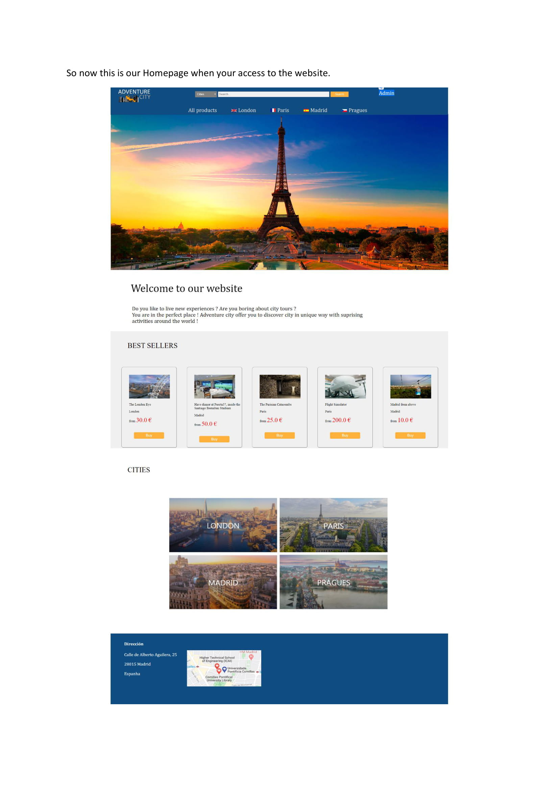
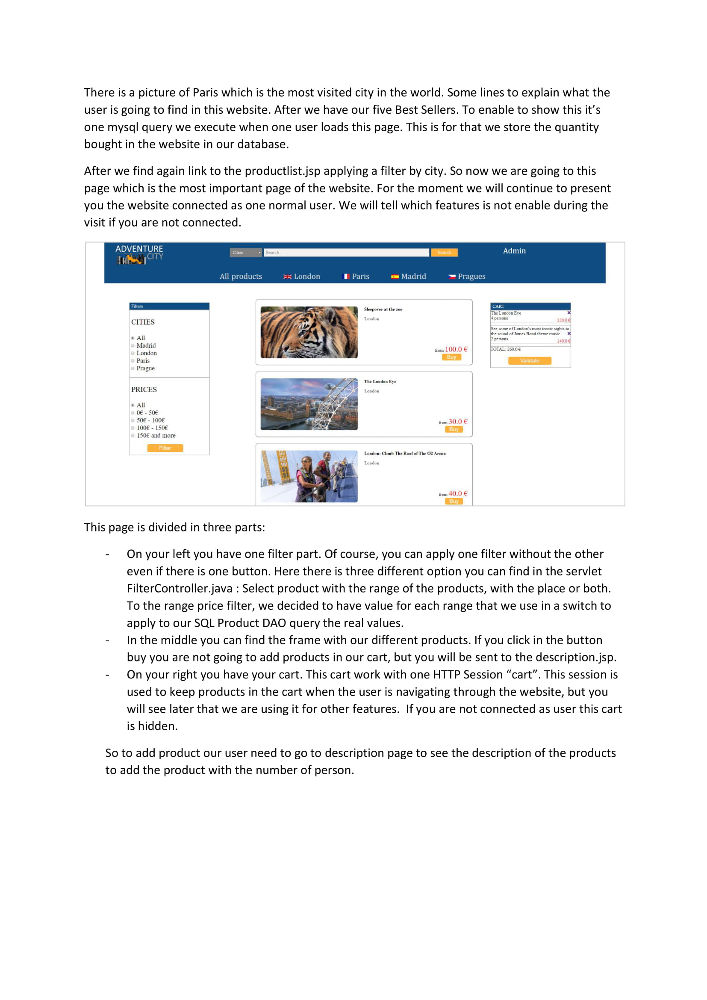

<h1> Projeto Final para o curso de Desenvolvimento WEB</h1>
<h3> Universidad Pontificia Comillas </h3>
<h4> Escuela de Ingeniería Industrial </h4>

 <strong> Toda descrição do projeto e suas funcionalidades estão no PDF </strong> 

 Desenvolvedores 

<ul>
  <li> Vitor Santos Pereira</li>
  <li> Clément </li>
</ul>  

<h2> Sobre </h2>

<pre>
    Durante meu intercâmbio acadêmio em Madrid - Espanha tive a oportunidade 
 de desenvolver um site completo do zero, na Universidad Pontificia Comillas,
 que me acolheu e me proporcionou uma experiência incrível.
 </pre>
